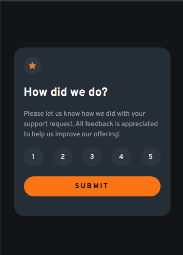
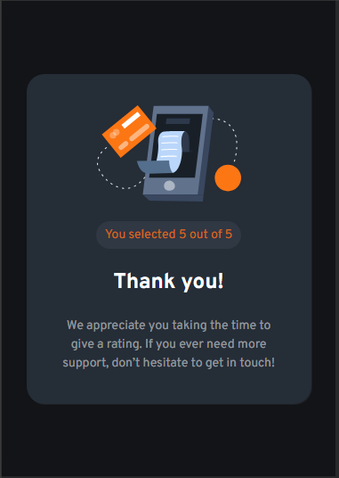
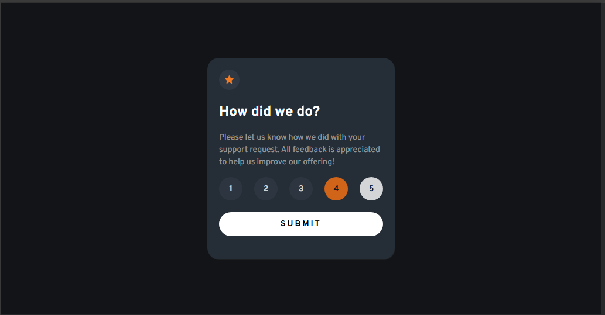

# interactive-rating-component-main
interactive-rating-component-main

This is a solution to the [interactive-rating-component-main challenge on Frontend Mentor](https://www.frontendmentor.io/challenges/interactive-rating-component-koxpeBUmI). Frontend Mentor challenges help you improve your coding skills by building realistic projects. 

## Table of contents

- [Overview](#overview)
  - [Screenshot](#screenshot)
  - [Links](#links)
- [My process](#my-process)
  - [Built with](#built-with)
  - [What I learned](#what-i-learned)
  - [Continued development](#continued-development)
- [Author](#author)

## Overview

### Screenshot

These are my screenshots showing how the project turned out.

- Main design:



- Thank you state:



- Active state:



### Links

- Solution URL: [My Solution](https://gillaercio.github.io/interactive-rating-component-main/)

## My process

### Built with

- Semantic HTML5 markup
- CSS custom properties
- Grid Layout
- Mobile-first workflow
- JavaScript

### What I learned

I took advantage of this project to practice the use of **JavaScript**:

forEach Iteration Structure

```js
let selectedRating = null;

document.querySelectorAll(".rating-btn").forEach((button) => {
  button.addEventListener("click", () => {
    document.querySelectorAll(".rating-btn").forEach((btn) => {
      btn.classList.remove("selected");
    });
    button.classList.add("selected");
    selectedRating = button.textContent;
  });
});

function feedback() {
  if (!selectedRating) {
    alert("Please, select a score before submitting.");
    return;
  }

  const content = document.querySelector("#default-content");
  const congrats = document.querySelector("#congrats-content");
  const score = document.querySelector("#score");

  score.textContent = selectedRating;

  content.style.display = "none";
  congrats.style.display = "block";
}
```

### Continued development

I would like to improve the use of the **JavaScript**.

## Author

- Frontend Mentor - [@gillaercio](https://www.frontendmentor.io/profile/gillaercio)
- Github - [My Github](https://github.com/gillaercio)
- LinkedIn - [My LinkedIn](https://www.linkedin.com/in/gildman-la%C3%A9rcio/)